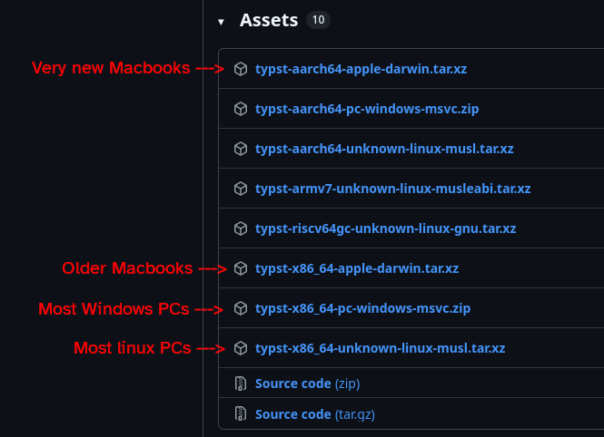
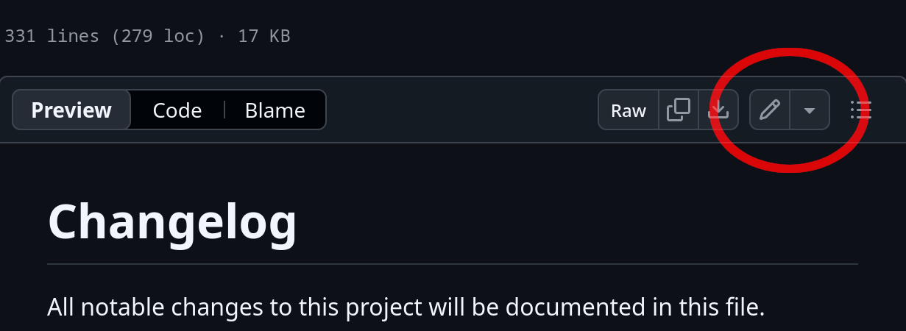

# Contributing to the Guide

> [!NOTE]
> Hello! Welcome to the Contributing Guide for the "Guide on Writing Data Management Plans" project!
> **We're so happy that you're interested in contributing!**
> 
> If you have never contributed before to a project on GitHub, this guide is for you!
> Also, remember that [the project leads](README.md#useful-contacts) are there to help you if you need support in getting started.

> This contributing guide was written taking inspiration from [The Turing Way Contributing Guide](https://book.the-turing-way.org/community-handbook/contributing/).

This guide is for those wishing to contribute to the development of the Guide on Writing Data Management Plans.

We welcome all contributions, from everyone, regardless of background.
Contributions are managed through [GitHub Issues](https://docs.github.com/en/issues/tracking-your-work-with-issues/learning-about-issues/about-issues) (you can find a list [here](https://github.com/Comunita-Italiana-Data-Steward/DMP-guide)), and [GitHub Pull Requests](https://docs.github.com/en/pull-requests/collaborating-with-pull-requests/proposing-changes-to-your-work-with-pull-requests/about-pull-requests).
If you are unfamiliar with [git](https://git-scm.org), [GitHub](https://github.com) and how to contribute using them, don't worry! This guide will teach you exactly that.

Please follow this guide to ensure your contributions are reviewed, discussed and integrated correctly.
It will also cover the style and tone of the document, so that you are aware of what we are trying to build together.

## Code of Conduct

> [!IMPORTANT]
> Please take a moment to read the code of conduct.
> It includes important implications, also regarding the use of AI during the project's development.

This repository and project are open to the public and are led by the Comunita' Italiana Data Stewards, a bottom-up initiative connecting Data Stewards across Italy.

To ensure a positive, productive, and inclusive environment, we expect all contributors to adhere to the project's [Code of Conduct](../CODE_OF_CONDUCT.md) as well as the [Manifesto](https://zenodo.org/records/15129936) of the CIDS.
The Code of Conduct also outlines who to contact in case of incidents, as well as enforcement procedures.

## Join the community
There are many ways to keep in touch with the community!

The main tool to contact and receive updates about the CIDS is the official mailing list.
To subscribe, please send an introductory email with your name, affiliation, and a brief bio to [data-stewards@lists.icdi.it](mailto:data-stewards@lists.icdi.it).

The Gruppo di Lavoro on DMPs holds monthly meetups with team members to discuss the ongoing projects.
To ask if you can join these meetups, please contact one of the group chairs (see the main [README](README.md) file.

Finally, most of the discussions regarding the project take place in the [issues](https://github.com/Comunita-Italiana-Data-Steward/DMP-guide/issues).
Check those pages to see if you can find an existing relevant conversation.
If you can't, start your own!
More on that in the [Jump in](#jump-in) section below.

## Collaborating on GitHub
To collaborate, we use [git](https://git-scm.com), a version control software, and [GitHub](https://github.com), a platform built on top of Git to facilitate collaboration.
Starting to use git and GitHub can be daunting tasks, but this guide (and us!) are here to guide you through the whole process.

### Setup
Here's what you will need to collaborate on the project:
- A laptop or PC, as many tools don't work on a phone or mobile device;
- A browser, like [Firefox](https://www.firefox.com/) (which you probably already have).
- A [GitHub Account](https://docs.github.com/en/get-started/start-your-journey/creating-an-account-on-github).
  GitHub accounts are free!
  Remember to set a profile picture and a recognizable name - it will make other recognize you immediately, benefitting you immensly!

**That's it!**
With this setup you will be able to edit files directly on GitHub and propose your changes, as well as discuss issues with others.
If you're happy with that, skip ahead to the next section of the guide.

If you wish to collaborate more, make larger changes and in general contribute heavily to the guide, it's highly suggested to set up your local working environment.

#### Local setup
> [!WARNING]
> Setting up for local development can be convoluted.
> It's meant for regular collaborators, and to those wishing to look at the typeset guide as they are writing it.
> You don't need this if you simply wish to make a one-off edit or suggest a change!
> Skip ahead if that is the case.

Here's what you will need to work on the guide locally:
- Install [git](https://git-scm.com) on your computer.
  Follow the [official guide on the Git website](https://git-scm.com/book/en/v2/Getting-Started-Installing-Git) to learn how.
  Git is compatible with GNU-Linux, MacOS and Windows.
- Install the [Typst](https://typst.com) compiler, which is available from the [Typst GitHub repository](https://github.com/typst/typst).
  - The README of the repository provides [an installation guide](https://github.com/typst/typst#installation).
  - We suggest you download the executable file for your platform (Linux/MacOS/Windows) from the [latest release page](https://github.com/typst/typst/releases).

  

  Save the file somewhere you will have access to and unzip it.
  > If you are on Linux, you can use your package manager of choice to install Typst.
  > Similarly, if you are on MacOS and use [homebrew](https://brew.sh/), you can install typst with this [homebrew recipe](https://formulae.brew.sh/formula/typst).
- **Only if you are on Linux or MacOS**, you will need to install Git Large File Storage ([git-lfs](https://git-lfs.com/)).
  To learn how, check out the [installation page](https://github.com/git-lfs/git-lfs#installing).

Finally, you will need to **access the command line**.
If you're using linux, you will be familiar with the command line.
For windows and MacOS users (and even beginner Linux users!), check out this [primer on the command line](https://tutorial.djangogirls.org/en/intro_to_command_line/).

There are also many, many interactive courses on the command line, which will take you from beginner to proficient in just a few hours.
For example, [Codecademy](https://www.codecademy.com/learn/learn-the-command-line) has a free course available.

You're ready to contribute like a power user!

## Typst markup language
To write the guide we use [Typst](https://typst.app/).
Typst is a document rendering engine that takes a plain text file (with the `typ` extension) and converts it to a bunch of different document types, including PDF.
Typst uses a sort of programming language to describe the contents of the eventual files it renders.

It is not necessary to know the ins-and-outs of the Typst language to contribute, but it's very useful to know the basics.
To learn how to use Typst, and how to write in the Typst markdown format, read the [Typst Tutorial](https://typst.app/docs/tutorial/), and in particular the chapter about [Writing in Typst](https://typst.app/docs/tutorial/writing-in-typst/).

Don't worry too much about making errors.
An automatic GitHub Action will run over all your PRs to check if the PDF can ultimately render

## Structure of the repository
Here's a brief overview of all the files in the `guide/` folder:
- `main.typ`: Every typst project has a single "main" file - for this project, it's this one.
  To compile the guide, the typst executable is called taking this file as input - everything else is used by this one.
- `template.typ`: This file contains function definitions and other useful variables used in other parts of the project.
  Importantly, it contains the version, publication date and other variables.
- `guide.typ`: This is the main file containing the whole prose of the guide.
  It is the one you will most likely want to edit if you have suggestions.
- `appendices.typ`: This file contains all appendices.
- `first_page.typ`, `edition_notice.typ` and `back_cover.typ` are special files full of code to tell typst how to design the front and back covers.
- `changelog.typ`: After every release version, this page is updated with the most salient changes to the guide.

## Jump in

The best way to get involved is to look in the open [issues](https://github.com/Comunita-Italiana-Data-Steward/DMP-guide/issues) and make your voice heard.
Join the conversation!

If you find an issue or wish to propose a change, first, look through the open issues, to see if it was already reported or if something similar was already proposed.
If you're sure that your issue/idea is new, [open a new issue](https://github.com/Comunita-Italiana-Data-Steward/DMP-guide/issues/new)!.
Select what best describes your issue and follow the instructions.

### Making and submitting changes
Suggesting changes depends on your setup.
Read the relevant section.

#### Online-only setup
To make a change with just your github account, navigate to the file you wish to modify and click the "edit" icon on the top-right of the page.
You may need to [create a fork of the project](https://docs.github.com/en/pull-requests/collaborating-with-pull-requests/working-with-forks/fork-a-repo) (check out also [what forks are](https://docs.github.com/en/pull-requests/collaborating-with-pull-requests/working-with-forks/about-forks) - GitHub will warn you that you cannot simply edit the file directly, but you will need to work on a copy.



Once you make your changes, commit them.
A popup will appear, asking you for a **commit message** and a **commit description**.
Please provide a one-liner describing your change, plus, optionally, a longer description.
Please **prepend the commit message with a proper tag**.
See the [Naming commits](#commit-tags) section later.

#### Offline setups
> [!IMPORTANT]
> This section assumes you have installed and configured `git` locally, and have `typst` available to you.
> Also, it takes for granted some experience with git.
> If that is not the case, check out the GitHub [guide to git](https://github.com/git-guides).

When working offline, first [fork the repository](https://docs.github.com/en/pull-requests/collaborating-with-pull-requests/working-with-forks/fork-a-repo).
Then, [clone the forked repository locally](https://github.com/git-guides/git-clone) and make your changes.

You can preview what the document will look like as you write your changes with

```bash
# From the base directory of the project
typst compile --font-path=guide/resources/fonts guide/main.typ guide.pdf
```
If you wish to constantly update the preview as you work, use `typst watch` instead of `typst compile`.

One you have finished working, [commit your changes](https://github.com/git-guides/git-commit), [push them to your fork](https://github.com/git-guides/git-push) then head on the fork's homepage.
A button should be there prompting you to open a pull request.

#### Submitting a pull request
After you make your edits, [submit a pull request](https://docs.github.com/en/pull-requests/collaborating-with-pull-requests/proposing-changes-to-your-work-with-pull-requests/creating-a-pull-request) and it will be reviewed as soon as possible.

One of the maintainers of the project will then decide whether or not to add your proposed change.
If so, they will merge your pull request - congratulations!
If the maintainers determine that there are issues with your PR, they will tell you what is wrong and either give you the possibility to edit the submission and try again, or close it if the changes are rejected.

If one of your PRs is not accepted - don't take it personally! Consider reviewing why it was rejected and try again.

## Best practices while submitting pull requests
Keep these in mind when you propose changes:
- Before you start working, remember to update your fork! This will make merging easier later on.
- Propose a single change with each pull request.
  If you submit a huge number of changes in a single request, it's much hard to review them.
  Additionally, some good changes might be mixed with bad changes, and they will be rejected or approved in bulk if you bundle them all together (with the effect that the good changes will be rejected due to the bad ones).
- Remember, **smaller, frequent commits are better than larger ones**.

### Commit tags
When you create new commits, it's best to prepend them with the type of change the commit contains.
This makes it much easier to identify at a glance what the commit did to the document.

Examples of tags are:
- `feat:` a new section, a modification of an older section, a deletion (e.g. `feat: explain better what a DMP is`);
- `fix:` fixing of an error, a typo or otherwise a mistake (e.g. `fix: two typos in chapter 9`)
- `chore:` a change related to housekeeping tasks, like editing github action files, CHANGELOGs, etc...
- `docs:` a change on the repository documentation, like the README or the CONTRIBUTING guide.

## Low effort proposals
This project is led by Data Stewards with time-consuming jobs, so time is precious.
To respect everyone's time, **low effort contributions will be rejected without explaination**.
Additionally, mentoring of people who show little effort or willingness to learn will not be provided.

Signs that a contribution is low effort are:
- Suggesting superficial changes, like whitespace changes or replacing words with synonyms without reason;
- Ignoring this contributing guide;
- Machine-generated contributions, even if only suspected;
- Verbose, vague text without a clear purpose and/or self-serving;

Signs that a contributor is not engaged are:
- Not giving sufficient information in pull requests;
- Providing meaningless comments (like "I agree!", "Yes", or "This is a real problem") which do not push the conversation forward;
- Ignoring reviews or other's comments on pull requests or issues.

The maintainers reserve the right to delete or block low-effort proposals.

## Adding contributors
We use the [All Contributors Bot](https://allcontributors.org/en/) to track contributors.
If you wish to add yourself or others to the all contributors list (after you have contributed), comment on an open PR or an issue with:

```
@all-contributors please add <username> for <contribution>
```

Check out all types of contributions [on the All Contributors website here](https://allcontributors.org/docs/en/emoji-key).
You can propose more people (`... add <username>, <username> for ...`) and more than one category (`... for <contribution>, <contribution> ...`) at once!

# Style Guide
To ensure cohesiveness, follow the project's [Style Guide](meta/STYLE_GUIDE.md).
