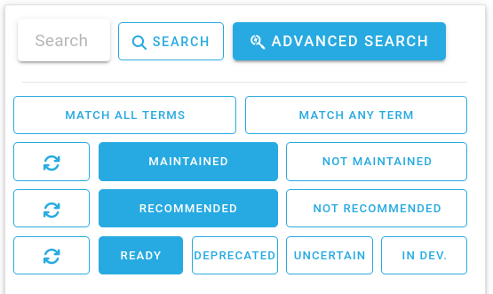

---
author:
  - name: Luca Visentin
    orcid: https://orcid.org/0000-0003-2568-5694
---

# Metadata
Metadata is **data regarding data**. For example, a description of the contents of a file is metadata regarding that file. Metadata looks and acts like data, can take the same shapes and sometimes it is the subject of the study at hand, just like data. For these reasons, **metadata is data, and should be treated as such**.

This means that all the attention that is given to data should also be given to metadata. To dispel any ambiguity, data and metadata is regarded, collectively, as (meta)data.

In your DMP, you're invited to list out:
- **What metadata will be provided** for each of your data types;
- **Which metadata standards will be used** to describe each data type;
- **The (file) format your metadata will be stored and shared in**;

Metadata is what makes your data readable and understandable for yourself, your future self, your collaborators, the one(s) analyzing it and anyone else who might re-use it later. Writing good, structured metadata can be time consuming at first, but allows you to reliably store and use all of your data without ever losing it, mistaking it for something else or letting it go "stale" and unusable (forgetting what is stored in a file after one or two years is very common!).

Good metadata also makes the future job of parsing data for analysis much easier - your data scientist or data analyst (or your future self!) will thank you for it.

## Gathering metadata
Metadata should be gathered **as soon as possible** following data collection. You can use a number of systems to gather metadata: from a blank file or piece of paper, to structured forms available online and shared with your collaborators, to electronic lab notebooks, dedicated platforms built specifically for this purpose. Different projects require different metadata gathering systems, but all converge in the creation of metadata files associated with one or more data files.

You can read "[File Organization](./file_organization.md)" to learn more on how to structure and order through these files, but this section is specifically dedicated to defining *what* metadata is needed and *how* to collect it.

You should gather enough metadata at a level of detail to allow others who have never worked with it to understand it and be certain about:

- **Who** created the (meta)data, **when** and **why**.
- **The nature of the phenomenon** that was measured and the **circumstances** around it;
- **How the recording took place**, and the characteristics of the processes that led to it, including everyone that was involved in gathering the data;
- Any **manipulation** of the data after it was taken (i.e. "preprocessing");
- The criteria used to **select the sampled phenomenon** (i.e. how sampling took place, if some samples were discarded and why);
- The **sample labels**, identifiers and other information related to tracking where the data has come from;
- **Related (meta)data**, such as previous or future versions of the same dataset.

And any other salient detail around the gathered data.

In particular, one of the most important aspects that should be included in the metadata of a file is its ***provenance***. Provenance is a broad concept including the choices made that led you to collect that particular piece of information (i.e. the sampling strategy used), the characteristics of the measurement apparatus, who took the measurement and any modifications of the data from the moment of its first recording.

## Metadata is objective
As you consider how you write your metadata, you should strive to be as detailed as possible and, obviously, try not to commit any errors or inprecisions.

Minimizing the possibility of error is also why you should try to set up a metadata-gathering process that is performed as closely to data collection as possible, possibly at the same time, and executed by the same person that collected the data.

You should exactly define what your (meta)data means. In other words, it is important to define every term you use in your metadata to be as unambiguous as possible. To do this, you can create---or even better, reuse---a **controlled vocabulary**.

Also, consider that the metadata you are gathering will not necessarily be used to exploit the data for the same purposes as yours. Indeed, when others re-use your data, their aims and objectives will probably be different than yours. You should therefore write your metadata in as much of a context-agnostic way as possible. Imagine that the people who will obtain your data know absolutely nothing, so that you need to be extremely explicit when discussing its meaning.

To increase discoverability, you should also write all your metadata in English, and avoid using abbreviations, if possible.

## Metadata is subjective
While metadata should be as objective, unambiguous and precise as possible, as well as providing the context and provenance of the data, the choice of exactly *which* metadata that needs to be collected to do this is largely subjective.

"**Interoperability**" is the capacity of a person or program to use data coming from two different contexts seamlessly, as if those two contexts were one and the same. Imagine, for example, two tables with the same headers and identical encoding - one could simply append one table's rows to the other, and obtain a new, larger table. The two tables are said to be *interoperable* with each other.

When deciding which metadata to collect, it is important to try and maximise its interoperability with other data already present online.

This has two main benefits: a more interoperable dataset is more easily found and used, meaning that its authors will be cited more. Second, a more interoperable ecosystem of data increases the value of **all** the data in it, which is a benefit for everyone involved.

Interoperability is increased both by writing structured, machine-readable metadata and by **selecting data definitions** (i.e. controlled vocabularies or ontologies) **that are broadly shared by the community which is most likely to reuse the data**.

The vision of creating a fully interoperable and machine-actionable ecosystem of data is what drove a team of academics to formulate the **FAIR principles**. See [www.go-fair.org](www.go-fair.org) for more information on the principles.

While writing your data management plan, consider how to increase the interoperability of your dataset, mainly by choosing standardized terms (like with controlled vocabularies, see above) and by using broadly applicable and open formats for (meta)data, like JSON, XML, etc...

## Where to find metadata schemas
There are many ways to find a metadata schema.

Most---if not all---datasets can be described with the [Data Cite](https://schema.datacite.org/) metadata schema. You can find a list of all the terms defined by the schema [here](https://datacite-metadata-schema.readthedocs.io/en/latest/properties/).

More information on controlled vocabularies is available below - check there and its related resources and select one or more vocabularies that are relevant in your research.

If those are unsatisfactory, you can also check the [FAIRSharing Registry of Standards](https://fairsharing.org/search?fairsharingRegistry=Standard&isRecommended=true&page=1&isMaintained=true&status=ready), and search for keywords relevant to your field. Be sure to check the "Maintained", "Recommended" and "Ready" checkboxes to find the most useful results. You should obtain a list of relevant standards which you can explore and potentially select for reuse.

<figure>

<figcaption>
Detail of the <a href="https://fairsharing.org/search?fairsharingRegistry=Standard&amp;isRecommended=true&amp;page=1&amp;isMaintained=true&amp;status=ready">FAIRSharing Registry of Standards</a> showing the recommended options when performing a search.
</figcaption>
</figure>

bold\[ As you are filling out your DMP, you **don't need** to write any metadata, create any vocabularies or decide every single term you will need! **You simply need to define which ones you are going to use**, and wether or not you are going to create new, ad-hoc terminology.

When the time comes to define your terms and create the metadata gathering forms, you can ask a data steward for help in actually using the vocabularies, terminology and/or ontologies you selected.

Remember that DMPs can be updated as you perform your research - don't worry about not being perfect right at the start.

You can also look for (or write one yourself!) what are called *FAIR Implementation Profiles*, or FIPs for short. FIPs outline all the solutions to the RDM problems we have highlighted here, and are usually shared openly. You can learn more about FIPS [on the Go FAIR foundation website](https://www.go-fair.org/how-to-go-fair/fair-implementation-profile/), and search through published FIPs on [FAIRConnect](https://fairconnect.pro/search-fair-nanopublications/). If you're feeling bold, you can search through the published FIPs and see if you can re-use the solutions someone else has already selected.

## Controlled vocabularies
Controlled vocabularies are "_standardized and organized arrangements of words and phrases_" (from the [Publications Office of the European Union](https://op.europa.eu/en/web/eu-vocabularies/controlled-vocabularies)).
In short, they are lists of terminology definitions, leaving as little to interpretation as possible.

You can easily create a basic controlled vocabulary by writing down terms and explicitly spelling out their meaning.
This is very useful for metadata, as you can define what every term in your key-value pairs (e.g. JSON), table headers or other data structures mean.

For example, you can define that the variable `sex` in a metadata table (which may have many interpretaions) refers specifically to the sex voluntarily given by the person interviewed, and nothing else.

Even better, you can check the Medical Subject Headings (MeSH) vocabulary and see that "sex" [has a very specific meaning](https://meshb.nlm.nih.gov/record/ui?ui=D012723), and you can browse other terms related to sex to find the one(s) that are most congruent with your use-case.

Ontologies, on the other hand, are "evolutions" of controlled vocabularies, defining not only terms, but also the nature of the relationships between them.

To learn more, check the University of Pittsburgh Library System [entry on controlled vocabularies](https://web.archive.org/web/20251201151859/https://pitt.libguides.com/metadatadiscovery/controlledvocabularies).
It contains useful information, examples and even commonly useful vocabularies. 

## Metadata formats

Metadata is usually made of all the one-to-one relationship between some characteristic and its value, for all files in your project. For this reason, the most common ways to gather metadata are either key-value files, like [JSON](https://en.wikipedia.org/wiki/JSON), [YAML](https://en.wikipedia.org/wiki/YAML), [TOML](https://en.wikipedia.org/wiki/TOML) or [XML](https://en.wikipedia.org/wiki/XML), or tabular data, like CSV or Excel worksheets.

Choose whatever format will be easiest to create and use in your project. If you need to, you can always convert it into more interoperable formats (like JSON) later on during the project, or when you'll deposit your data.

## Gathering Metadata

You can gather metadata in a number of ways. The main characteristics of your metadata-gathering method should be:
- You gather all the metadata you need, making it hard to forget to gather something;
- You use the pre-determined metadata terminology you defined in your DMP (e.g. to write down "male" and not "Male").
- To be quick and easy to use, as you or your team will need to constantly use it as they gather the data.

Here are some options for you to consider:

| **Method** | **Pros** | **Cons** |
| --- | --- | --- |
| Pen and paper | No setup needed, easy to use, readily available | No quality checks (completeness, formatting, etc...), needs to digitalize the data after acquisition |
| Printed out forms | Easy to use, relatively quick, easy to set up | Need to digitalize and quality-check the data after acquisition, need to print paper forms |
| [Microsoft Forms](https://forms.office.com/) | Easy to use, data is natively digital, can apply restrictions on answers (e.g. with drop-down menus) | Requires some setup, saves all data as tabular Excel files, cannot represent all data types |
| [REDCap](https://project-redcap.org/) | Supports all kids of data, allows it to be quality-checked during ingestion, uses formal databases   | Harder to set up, requires consortium partecipation |
| [EUSurvey](https://ec.europa.eu/eusurvey/) | Supports all kinds of data, is free, available to any European citizen, and owned by the EU | Somewhat hard to set up, really powerful but with a steep learning curve |

You can also decide to use an integrated environment for your data and metadata needs, like an [electronic lab notebook](https://datamanagement.hms.harvard.edu/collect-analyze/electronic-lab-notebooks) or similar solutions, like [DataLad](https://www.datalad.org/).

If you can, you should contact your Data Steward and inform them of your choice. They will help you set it up, as well as check if you are forgetting some important metadata that you should gather.

If you plan to use Electronic Lab Notebooks or other programs which require particular maintenance, you should contact your department's ICT expert and ask them for support.

> Related activity: .
